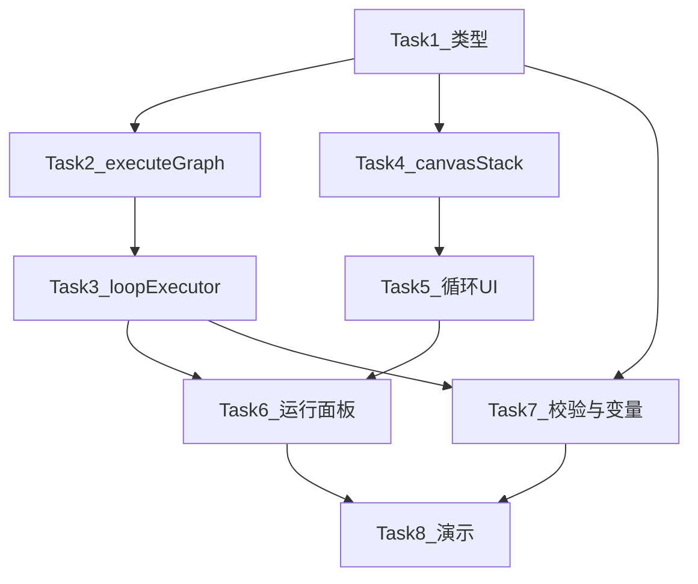

# 循环节点 MVP 分步实现指南（自学版）

> **执行约定：** 本计划供你按步骤自己写代码与验证。只有当你明确说「帮我实现」时，代理才应改仓库。

**Goal:** 画布可放循环节点；双击钻入编辑一层子图；运行时按最大次数（可选提前退出）递归执行子图；运行面板能看到第几次迭代。

**Architecture:** 循环节点对外是普通 1 入 1 出节点，对内嵌 `data.subflow`。引擎抽出 `executeGraph`，循环执行器每轮用**全新 visited** 跑子图，共享同一份 `context.variables`。编辑器用 `canvasStack` 切换主画布 / 子画布，保存模型不用改 Prisma。

**Tech Stack:** 现有 Next 16、React Flow、Zustand、现有 BFS 引擎、`evaluateCondition`。

## Global Constraints

- 只支持 **一层** 子图（子图内禁止再放 LOOP）
- 退出：`maxIterations` 硬上限 + 可选 `breakCondition`（为空则跑满）
- 变量格式是 `{{节点label.字段}}`，不是 `{{nodeId.field}}`
- 不做 for-each、嵌套循环、循环体内断点续跑、迭代结果数组
- 循环中途失败 = 整个 LOOP 节点失败；resume 会从该 LOOP 整段重跑

---

## 建议顺序（哪些可并行）



- Task 1 必须先做。
- Task 2 和 Task 4 **互不依赖**，做完 Task 1 后可任选一条。
- Task 5 依赖 Task 4（要有 enter/exit）。
- Task 3 依赖 Task 2（要有可递归调用的图执行）。
- Task 6 依赖 Task 3 + Task 5（有执行、有节点）。
- Task 7 可在 Task 3 之后随时做，不堵 UI。
- Task 8 全部通了再搭演示图。

每做完一题，停下来对照「验收」再往下。不要一次改五个文件。

---

## 文件地图

**新建**

- `lib/workflow/createEmptySubflow.ts` — 空子图 Start + End
- `lib/workflow/engine/loopExecutor.ts` — 循环执行器
- `components/workflow/nodes/LoopNode.tsx`
- `components/workflow/panels/loopPanel/index.tsx`

**改造**

- [`lib/workflow/types.ts`](lib/workflow/types.ts)
- [`lib/workflow/engine/types.ts`](lib/workflow/engine/types.ts)
- [`lib/workflow/engine/workflowEngine.ts`](lib/workflow/engine/workflowEngine.ts)
- [`lib/workflow/engine/executor.ts`](lib/workflow/engine/executor.ts)
- [`lib/workflow/registerNodes.ts`](lib/workflow/registerNodes.ts)
- [`lib/stores/workflowStore.ts`](lib/stores/workflowStore.ts)
- [`lib/stores/workflowRunStore.ts`](lib/stores/workflowRunStore.ts)
- [`components/workflow/editor/CanvasContent.tsx`](components/workflow/editor/CanvasContent.tsx)
- [`components/workflow/toolbar/NodeSelector.tsx`](components/workflow/toolbar/NodeSelector.tsx)
- [`components/workflow/panels/RunPanel.tsx`](components/workflow/panels/RunPanel.tsx)
- [`lib/workflow/validator.ts`](lib/workflow/validator.ts)
- [`lib/workflow/variableUtils.ts`](lib/workflow/variableUtils.ts)

---

## Task 1：类型与空子图工厂

**目标：** 类型能表达循环节点；能生成一张合法的空子图。此任务不碰引擎、不碰 UI。

**改这些文件**

- [`lib/workflow/types.ts`](lib/workflow/types.ts)
- 新建 `lib/workflow/createEmptySubflow.ts`

**步骤**

1. 在 `types.ts` 的 `NodeType.LOOP` 旁补数据接口（`LOOP` 枚举已经存在，不要重复加）：

```ts
export interface SubflowGraph {
  nodes: WorkflowNode[];
  edges: WorkflowEdge[];
}

export interface LoopOutputVariable {
  id: string;
  name: string;
  /** 引用当前 variables，如 {{改写.text}} */
  value: string;
}

export interface LoopNodeData extends BaseNodeData {
  maxIterations: number;
  breakCondition?: string;
  subflow: SubflowGraph;
  outputs: LoopOutputVariable[];
}
```

2. 把 `LoopNodeData` 加进 `WorkflowNodeData` union。漏了这一步，后面 `updateNodeData` 和执行器 `as LoopNodeData` 都会不顺。

3. 新建 `createEmptySubflow()`：返回 `{ nodes, edges }`，包含：
   - Start：`id` 用 `sub_start_${Date.now()}_...`（不要用主图的 `start_1`），`data.label` 用 **「循环开始」**（避免和主图「开始」抢同一个变量前缀），`inputs: []`
   - End：label **「循环结束」**，`outputVariables: []`
   - 一条边把两者连上（否则 Task 7 校验会失败）
   - 位置随便：Start `(100, 160)`，End `(420, 160)`

**验收**

- `tsc --noEmit` 或保存后 IDE 无类型错误。
- 在临时 `console.log(createEmptySubflow())` 里应看到 2 个节点、1 条边，且 Start/End 的 id 不是 `start_1` / `end_1`。

**学习点：** 子图必须自己有 Start/End，现有 BFS 才能原样复用；label 即变量命名空间。

**常见坑：** `SubflowGraph` 引用了 `WorkflowNode`，而 `WorkflowNode` 又用 `WorkflowNodeData`。把接口放在 `WorkflowNode` 定义**之前**会循环引用类型。把 `LoopNodeData` 放在 `KnowledgeNodeData` 后面、`WorkflowNodeData` union 前面即可。`SubflowGraph` 可先写成：

```ts
export interface SubflowGraph {
  nodes: WorkflowNode[];
  edges: WorkflowEdge[];
}
```

若 TS 报循环，把 `nodes` 先写成 `Node<WorkflowNodeData, NodeType>[]` 或把 `SubflowGraph` 放到 `WorkflowNode` 定义之后。

---

## Task 2：抽出 `executeGraph`

**目标：** 「跑一张 DAG」和「整次工作流生命周期」分开。循环还没实现，但父图行为必须与现在完全一致。

**只改** [`lib/workflow/engine/workflowEngine.ts`](lib/workflow/engine/workflowEngine.ts)

**为什么必须先做：** 循环执行器如果直接调现有 `workflowEngine.execute()`，会：

1. 生成新 `runId`
2. 把 `shouldStop` 重置为 false（停不掉）
3. 子图跑完触发 `onWorkflowStatusChange(SUCCESS)`，父图被误标成功
4. `finally { isRunning = false }` 把还在跑的父图引擎关掉

**步骤**

1. 把 `runFromQueue` 里「队列耗尽后的收尾」拆成可配置：

```ts
private async executeGraph(params: {
  nodes: WorkflowNode[];
  edges: Edge[];
  context: WorkflowRunContext;
  input: WorkflowRunInput;
  emitWorkflowTerminalStatus: boolean;
  runId: string;
  startTime: number;
}): Promise<WorkflowRunResult>
```

内部仍然：`findStartNode` → `visited = new Set()` → 调现有 `runFromQueue`。

2. `runFromQueue` 到达 `NodeType.END` 时：
   - 父图（`emitWorkflowTerminalStatus === true`）：保持现有「到达结束节点，工作流执行完成」
   - 子图：改成「本轮子图结束」，**不要**说工作流完成

最简单的做法：给 `runFromQueue` 也传入 `emitWorkflowTerminalStatus`，两处 log / 最终 `onWorkflowStatusChange` 都看这个开关。

3. 公开方法保持原签名：

- `execute()`：创建 `runId` / `context`，设 `isRunning=true`、`shouldStop=false`，调 `executeGraph({ emitWorkflowTerminalStatus: true })`，`finally` 里才 `isRunning = false`
- `resume()`：同样只在外层管 `isRunning`

4. **`executeGraph` 自身不要 `finally { isRunning = false }`**，也不要改 `shouldStop`。它只是一次图遍历。

5. 先把 `executeGraph` 做成 `public`（或包内导出），Task 3 的循环执行器要调它。

**验收（回归，很重要）**

用现有不含循环的工作流跑一遍：

- Start → LLM/API → End 仍然成功
- 点停止仍然能停
- 故意让一个节点失败，仍会 PAUSED 且能续跑

如果这一步把旧流程跑坏了，**不要进入 Task 3**。

**学习点：** 递归子图 = 同一套 BFS + 新的 visited；生命周期（runId / stop / 终态）必须留在最外层。

---

## Task 3：循环执行器

**目标：** 引擎碰到 LOOP 会按次数跑子图，变量能进能出。此任务可以先不接 UI：用一份手写 JSON 当 `subflow`。

**改这些文件**

- 新建 [`lib/workflow/engine/loopExecutor.ts`](lib/workflow/engine/loopExecutor.ts)
- [`lib/workflow/engine/executor.ts`](lib/workflow/engine/executor.ts) 的 `nodeExecutors` 补 `[NodeType.LOOP]`
- [`lib/workflow/engine/types.ts`](lib/workflow/engine/types.ts)：`WorkflowRunContext` / `WorkflowRunCallbacks` 增加可选 `onIterationChange?: (loopNodeId, current, max) => void`

**循环依赖怎么处理**

```
workflowEngine.ts → getNodeExecutor(executor.ts)
executor.ts → loopExecutor.ts
loopExecutor.ts → workflowEngine 单例
```

浏览器 / Next 里只要 **在 `execute()` 函数体内**才访问 `workflowEngine`，运行时引用已经初始化，一般没问题。不要在 `loopExecutor.ts` 文件顶层调用 `workflowEngine.executeGraph`。

若启动时报 undefined，改成：

```ts
const { workflowEngine } = await import("./workflowEngine");
```

或把 `executeGraph` 挂到 `context` 上（`context.executeGraph = ...`），循环执行器只依赖 context。后一种更深、更可测，面试也能讲「把递归能力从单例里解耦」。MVP 用延迟引用单例即可。

**执行逻辑（按这个顺序写，不要一次写完再调）**

1. `max = Math.max(1, data.maxIterations || 5)`
2. `context.onNodeStatusChange(node.id, RUNNING)`
3. `for i in 1..max`：
   - `context.variables[`${data.label}.index`] = i`
   - `onLog`：`第 ${i}/${max} 次迭代开始`
   - `onIterationChange?.(node.id, i, max)`
   - `child = await workflowEngine.executeGraph({ nodes: data.subflow.nodes, edges: data.subflow.edges, context, input: { variables: context.variables, callbacks: 从 context 透传 }, emitWorkflowTerminalStatus: false, runId: context.runId, startTime })`
   - 每一轮必须让 `executeGraph` **自己 new visited**。不要把父图的 visited 传进去。
   - 若 `STOPPED` → 循环节点 FAILED（或直接返回对应状态）
   - 若子图不是 SUCCESS → 循环节点 FAILED，`error` 带上子图 error
   - 记下 `lastEndOutputs = child.finalOutput`
   - 若 `breakCondition` 非空：`evaluateCondition(breakCondition, context.variables)`，true 则 log 提前退出并 `break`
4. 按 `data.outputs` 写回父图：

```ts
for (const output of data.outputs || []) {
  const resolved = resolveVariables(output.value, context.variables);
  context.variables[`${data.label}.${output.name}`] = resolved;
  outputs[output.name] = resolved;
}
```

5. 返回 SUCCESS + `outputs`。

**子图 Start 注意：** 现有 `startNodeExecutor` 会检查 `inputs` 必填。空子图 `inputs: []` 会直接成功。不要给子图 Start 填和主图一样的必填 inputs，否则每轮都会缺输入失败。

**手写验收（此时还没有画布钻入）**

在临时脚本或测试页构造：

- 父图：Start → Loop → End
- Loop.subflow：循环开始 → 循环结束（空跑）
- `maxIterations: 3`，`breakCondition: ""`

跑完后日志应出现 3 次「第 i/3 次」。`context.variables['循环.index']` 最后为 `3`。

再测提前退出：子图里放一个会写入 `判定.passed = true` 的节点（可用 Code 节点 mock，或临时改 executor 写死变量），`breakCondition` 设 `{{判定.passed}} == true`，应在第 1 次后退出。

**学习点：** 循环不是图上的环，是「节点内部的 for + 递归 DAG」。visited 按轮重置，变量按 label 覆盖。

**常见坑**

- 忘了注册 `nodeExecutors[LOOP]` → 引擎 log「没有执行器，跳过」，循环像没执行
- 子图 `subflow.nodes` 为空 → `未找到开始节点`，整节点失败
- 把父图 `visited` 传进子图 → 第二轮全部 skip

---

## Task 4：编辑器画布栈

**目标：** 双击还没接 UI 之前，Store 已能进入 / 退出 / 写回子图。可用 React DevTools 或临时按钮验证。

**改这些文件**

- [`lib/stores/workflowStore.ts`](lib/stores/workflowStore.ts)
- [`components/workflow/editor/CanvasContent.tsx`](components/workflow/editor/CanvasContent.tsx) 里那段「nodes 为空就插入 start_1 / end_1」的 `useEffect`

**状态**

```ts
interface CanvasFrame {
  loopNodeId: string;
  nodes: WorkflowNode[];
  edges: WorkflowEdge[];
}

canvasStack: CanvasFrame[]; // [] = 正在看主图
```

`initialState.canvasStack = []`。`reset()` 要清栈。

**三个 action（必须都有）**

1. `enterSubflow(loopNodeId)`
   - 当前画布找到该 LOOP 节点，否则 return
   - `subflow = data.subflow?.nodes?.length ? data.subflow : createEmptySubflow()`
   - push `{ loopNodeId, nodes: state.nodes, edges: state.edges }`
   - 切到 `subflow.nodes / subflow.edges`，`selectedNodeId = null`
   - `useWorkflowStore.temporal.getState().clear()`（进出子图会整表替换，不 clear 的话 Ctrl+Z 会把主图撤回来）

2. `exitSubflow()`
   - 栈空则 return
   - 把当前 `nodes/edges` 写进父快照里那个 loop 节点的 `data.subflow`
   - pop，restore 父 `nodes/edges`，选中该循环节点，`isDirty = true`
   - 再 `temporal.clear()`

3. `flushSubflowToRoot(): { nodes, edges }`
   - **不要把用户踢回主画布**
   - 从栈顶往根走，一层层把当前图画进对应 loop 的 `subflow`
   - 返回根图 `{ nodes, edges }`
   - 同时把 `canvasStack` 里每层快照也更新成写回后的版本（否则保存后栈是脏的）

`saveWorkflow` 开头改成：

```ts
const { nodes, edges } = get().flushSubflowToRoot();
// 用返回的根 nodes/edges 调 workflowService.saveWorkflow
```

即使人还在子图里点保存，落盘的也是完整嵌套 JSON。

**必须修的现有坑**

[`CanvasContent.tsx`](components/workflow/editor/CanvasContent.tsx) 约 86–106 行：

```ts
if (nodes.length === 0) return;
// 插入 start_1 / end_1
```

进入尚未种过节点的循环时，`nodes` 会先空一帧。改成：

```ts
const canvasStack = useWorkflowStore((s) => state.canvasStack);
if (canvasStack.length > 0) return; // 子图交给 enterSubflow 去种
if (nodes.length > 0) return;
// 仅主图第一次进入才种 start_1 / end_1
```

**临时验收（可在 CanvasToolbar 先加两个调试按钮，Task 5 再删）**

1. 主图手动 `addNode(LOOP)` 还没有 UI 时，可在控制台：`useWorkflowStore.getState().addNode` 还没注册 LOOP 会失败。Task 4 可先硬编码一个 LOOP 节点 `setNodes([...nodes, fakeLoop])` 再 `enterSubflow`。
2. 更省事：把 Task 4 和 Task 5 的「注册 LOOP + 默认 data」做完最小注册后再测栈。若你想严格独立，Task 4 用 `setNodes` 塞一个 `type: "loop"` 的假节点即可。

**验收**

- 进入后画布变成 2 个节点（循环开始 / 循环结束）
- 在子图加一个 LLM，点返回，再进入，LLM 还在
- 子图里不要再触发主图的 `start_1` 自动插入
- 在子图里点保存，刷新页面，主图 LOOP 的 `data.subflow` 里有刚才的子图

**学习点：** 视图是 `nodes/edges`，真相是根图 + 嵌在节点里的 subflow。栈只是编辑器光标。

---

## Task 5：循环节点 UI

**目标：** 用户能从节点面板拖出循环、配次数、双击进去、有返回。

**改 / 新建**

- 新建 `components/workflow/nodes/LoopNode.tsx`（照 [`StartNode`](components/workflow/nodes/StartNode.tsx) / BaseNode：1 个入 handle、1 个出 handle；副标题显示 `最多 N 次`）
- `components/workflow/nodes/index.ts` 导出
- 新建 `components/workflow/panels/loopPanel/index.tsx`：`maxIterations`（number）、`breakCondition`（文本）、`outputs`（可先做成和结束节点类似的 name + value 列表；最少支持手写一条 `{ name: "text", value: "{{改写.text}}" }`）
- [`registerNodes.ts`](lib/workflow/registerNodes.ts)：`category: "logic"`，`maxInputs: 1`，`maxOutputs: 1`，`defaultData`：

```ts
{
  label: "循环",
  maxIterations: 5,
  breakCondition: "",
  subflow: { nodes: [], edges: [] },
  outputs: [{ id: "out_text", name: "text", value: "" }],
}
```

- [`CanvasContent.tsx`](components/workflow/editor/CanvasContent.tsx)
  - `nodeTypes[NodeType.LOOP] = LoopNode`
  - `onNodeDoubleClick`：`node.type === NodeType.LOOP` 则 `enterSubflow(node.id)`
  - `canvasStack.length > 0` 时在 `Panel position="top-left"` 放「返回主画布」按钮，**不要**占用 [`EditorHeader`](components/workflow/editor/EditorHeader.tsx) 那个回列表的返回
- [`NodeSelector.tsx`](components/workflow/toolbar/NodeSelector.tsx)：
  - 主图：继续排除 START（现有）
  - 子图：再排除 `LOOP`（以及建议排除第二个 START，子图已有循环开始，避免用户再拖一个）

**验收**

- 主图能拖出紫色/橙色逻辑节点「循环」
- 双击进入，顶栏能返回
- 返回后再双击，子图编辑还在
- 子图节点面板里没有「循环」

**学习点：** 循环体不在属性面板里拖拽，钻入是子图编辑的标准交互（Dify / n8n 同构，面试可类比）。

---

## Task 6：运行面板迭代反馈

**目标：** 运行时能看见「第几次 / 共几次」和带迭代前缀的日志。运行按钮必须跑根图。

**改这些文件**

- [`lib/stores/workflowRunStore.ts`](lib/stores/workflowRunStore.ts)
- [`components/workflow/panels/RunPanel.tsx`](components/workflow/panels/RunPanel.tsx)
- 视情况改 [`EditorHeader`](components/workflow/editor/EditorHeader.tsx) 若它也调 `startRun`

**Store**

```ts
loopProgress: Record<string, { current: number; max: number }>;
```

`LogEntry` 增加可选 `iteration?`、`loopNodeId?`。

`startRun` / `resumeRun` 的 callbacks 增加：

```ts
onIterationChange: (loopNodeId, current, max) => {
  set((s) => ({
    loopProgress: {
      ...s.loopProgress,
      [loopNodeId]: { current, max },
    },
  }));
},
```

`onLog` 里若当前 `loopProgress` 有进行中的循环，把 `iteration` 写进 LogEntry（简单做法：取 `Object.values(loopProgress)[0]`；多循环 MVP 不考虑）。

`resetRun` / `startRun` 开头清空 `loopProgress`。

**运行必须 flush**

`RunPanel` 现在是：

```ts
startRun(nodes, edges); // 这是当前视图！人在子图里会只跑子图
```

改成：

```ts
const { nodes, edges } = useWorkflowStore.getState().flushSubflowToRoot();
startRun(nodes, edges);
```

节点状态列表不要用「当前视图 nodes」。增加 `getRootGraph()`：栈空则当前 nodes；否则用 `flush` 的返回值（或 `canvasStack[0]` 写回后的根）。列表只展示根图节点。循环节点 RUNNING 时旁边渲染 `第 {current}/{max} 次`。

日志：`[第 2 次] 🔁 ...` 即可，不必先做 Collapse 分组。

**验收**

- 空转 3 次的循环，面板出现 3 组迭代日志，循环节点旁数字 1/3 → 2/3 → 3/3
- 人留在子图点运行，跑的仍是整张主图（下游 End 会执行）
- 子图内节点在钻入视图下会闪 running（`nodeStatuses[innerId]` 被更新）——加分，不是必须

**学习点：** 运行态和编辑视图解耦：运行永远针对根图；子图画布只是编辑光标。

---

## Task 7：校验与变量选择器

**目标：** 空循环 / 缺 Start 的子图在点运行时被拦住；下游能在变量选择器里看到 `循环.text`。

**改** [`lib/workflow/validator.ts`](lib/workflow/validator.ts)、[`lib/workflow/variableUtils.ts`](lib/workflow/variableUtils.ts)

**校验**

在 `validateWorkflowForRun` 末尾（或第 7 步之后）遍历根图所有 `type === loop`：

- `maxIterations` 必须是 `>= 1` 的有限数字
- `subflow.nodes` 至少有 Start + End
- 对 `subflow.nodes/edges` **递归调用**现有 `validateWorkflowForRun`（子图是一张独立小 DAG）
- 子图 issue 的 `message` 前加 `[循环: ${label}]`，避免和主图 Start 报错分不清
- 子图里若出现 `type === loop`，报「暂不支持嵌套循环」

`validateWorkflowNodes` 给 LOOP 补：未连入边时 `missing_connection`（和其他中间节点一致）。

**变量选择器**

`extractNodeOutputs` 增加 `case NodeType.LOOP`：把 `data.outputs` 映射成可选变量（再额外加一个 `index` 更好讲）。这样主图 LOOP 下游的 LLM 能点选 `{{循环.text}}`。

子图内选择器：MVP **不**做父图变量自动补全。运行时扁平 `variables` 本来就能解析 `{{开始.query}}`。面试时承认「编辑器补全只看当前画布上游」。

**验收**

- 拖一个循环不双击、不连线，点运行：有结构错误而不是引擎抛「未找到开始节点」
- 子图拆掉到 End 的边，运行报子图连通错误
- 主图 LOOP 下游 LLM 的变量面板能看到循环的 outputs

---

## Task 8：质量判定演示 + 面试过稿

**目标：** 一条能讲 2 分钟的图，而不是功能清单。

**建议图（主画布）**

`开始(topic)` → `初稿`（LLM）→ `质量循环` → `结束`

- 开始输入：`topic`
- 初稿 prompt：根据 `{{开始.topic}}` 写一段产品介绍，输出 `text`
- 质量循环：`maxIterations = 5`，`breakCondition = {{质量判定.passed}} == true`，`outputs: [{ name: "text", value: "{{改写.text}}" }]`（若第一轮就过关、改写没跑，value 可改成更稳妥的写法：结束节点收集；MVP 可让判定不过才改写，过关时改写节点不跑——此时 `{{改写.text}}` 可能是空的。更稳的演示：子图 End 的 outputVariables 写成「有改写用改写，否则用初稿」，或循环 outputs 直接 `{{质量判定.text}}`。选一种并在面试时能解释。）

**子图建议**

`循环开始` → `质量判定`（LLM，输出 `passed` 为 `true`/`false` 字符串，`reason`）→ `分支器`：

- 如果 `{{质量判定.passed}} == true` → 循环结束
- 否则 → `改写`（LLM，吃 `{{初稿.text}}` 和 `{{质量判定.reason}}`）→ 循环结束

判定 prompt 要明确要求只输出 `true` 或 `false`，否则 `evaluateCondition` 对自由文本会不好使。可让判定节点只输出 `passed`，prompt 写死「只回答 true 或 false」。

**自己先跑的检查单**

1. topic 随便填，循环至少跑 1 次
2. 把判定 prompt 改成「永远 false」，应跑满 5 次再结束
3. 改成「永远 true」，应第 1 次提前退出
4. 运行面板能指着日志说「这是第 2 次判定失败，第三次改写」

**面试 30 秒（背这五句）**

1. 主图必须是 DAG，BFS + visited 保证每节点一次、分支只走命中边。
2. 循环是环，不能画在主图：留 visited 则第二轮被跳过，去掉 visited 会转死。
3. 所以 LOOP 对外是普通节点，对内是嵌套小 DAG；执行时递归同一套 BFS，每轮新 visited，共享变量表。
4. 退出两道闸：业务条件（质量过了）+ max（防止模型永不 pass）。
5. 变量扁平、后轮覆盖前轮，正好是「改到过关」；历史看日志。

**被追问时主动说的边界**

- 没有 for-each、没有嵌套循环、没有 per-iteration checkpoint
- 没有词法作用域，全靠 `label.field`，子图 label 不能和父图撞名
- 和生产级（Dify Loop / 子 workflow）差在：隔离作用域、并发、持久化迭代状态

---

## 明确不做（防范围膨胀）

- 子图再套循环
- 数组 for-each / 并行迭代
- 循环内部 resume 从第 N 次继续
- 变量选择器自动注入全部父图变量
- 把子图节点画进主图缩略图
- 改 Prisma schema

---

## 卡住时怎么查

| 现象 | 先看 |
| --- | --- |
| 循环被跳过 | `nodeExecutors` 有没有 LOOP |
| 只跑一轮内部节点 | 子图 visited 是否复用了父图 / 是否没在 executeGraph 内 `new Set()` |
| 子图跑完整图变成功 | `emitWorkflowTerminalStatus` 子图是否误传 true |
| 停止按钮失灵 | executeGraph 是否把 `shouldStop` 重置了 |
| 进入循环出现两个「开始」 | CanvasContent 空画布 useEffect 没挡子图 |
| 保存后子图丢失 | 保存前没 `flushSubflowToRoot` |
| 变量取不到 | label 是否写对；outputs.value 是否用了 `{{循环开始.xxx}}` 这种不存在的 key |
| 提前退出不生效 | `passed` 实际值带引号/换行；用日志把 `evaluateCondition` 的左右两边打出来 |
