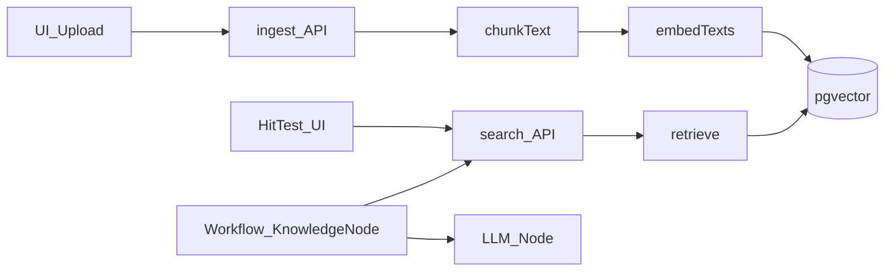

# RAG MVP 分步实现指南（自学版）

> **执行约定：** 本计划供你按步骤自己写代码与验证。确认计划后若只想拿清单自学即可；只有当你明确说「帮我实现」时，代理才应改仓库。

**Goal:** 用户上传 txt/md → chunk + embedding 入库 → 语义命中测试；Workflow 可配置并调用同一套 `retrieve`。

**Architecture:** Next.js API + Prisma/Postgres(pgvector) 存知识库/文档/切片向量；DashScope `text-embedding-v3` 做向量；核心 `lib/rag/*` 暴露 `ingest` / `retrieve`；Knowledge UI 与 Workflow `knowledge` 节点共用检索。

**Tech Stack:** 现有 Next 16、Prisma 7、Postgres、`QWEN_API_KEY`/DashScope、Vercel AI SDK（Chat 已有）；新增 pgvector + 手写 chunk/embed/retrieve（不引入 LangChain）。

## Global Constraints

- 仅 `.txt` / `.md`；解析策略 MVP 只实现 `text` + `auto`（固定 `chunkSize`/`chunkOverlap`）
- 向量库：Postgres + pgvector（维度与 embedding 模型一致，推荐 1024）
- Workflow：新增 Retrieve/Knowledge 节点；Agent preview 自动注入留到下一阶段
- 前端逐步废弃 localStorage 真路径；mock 可保留作 seed，默认不依赖
- 统一检索入口：`retrieve({ knowledgeBaseId, query, topK, scoreThreshold })`

---

## 文件地图（将创建 / 改造）

**新建**

- `lib/rag/chunk.ts` — 文本切片
- `lib/rag/embed.ts` — DashScope embeddings
- `lib/rag/ingest.ts` — 入库编排
- `lib/rag/retrieve.ts` — 语义检索（对外主 API）
- `app/api/knowledge/**` — CRUD / upload / search
- `app/api/workflow/nodes/knowledge/route.ts` — 节点执行入口（可选，模式对齐 LLM 节点）
- Workflow：`KnowledgeNode.tsx`（或等价）+ `KnowledgeNodeData` 类型

**改造**

- [`prisma/schema.prisma`](prisma/schema.prisma) + SQL migration（`CREATE EXTENSION vector`）
- [`lib/services/knowledge.service.ts`](lib/services/knowledge.service.ts) → async `fetch`（对齐 [`agent.service.ts`](lib/services/agent.service.ts)）
- [`app/knowledge/list/page.tsx`](app/knowledge/list/page.tsx)、[`create/page.tsx`](app/knowledge/create/page.tsx)、[`[id]/page.tsx`](app/knowledge/[id]/page.tsx)
- [`lib/workflow/types.ts`](lib/workflow/types.ts)、[`registerNodes.ts`](lib/workflow/registerNodes.ts)、[`engine/executor.ts`](lib/workflow/engine/executor.ts)、[`validator.ts`](lib/workflow/validator.ts)、[`variableUtils.ts`](lib/workflow/variableUtils.ts)、[`workflowRun.service.ts`](lib/services/workflowRun.service.ts)

**可弱化**

- [`lib/services/knowledge.mock.ts`](lib/services/knowledge.mock.ts) — 不再被详情页命中测试依赖

---

## Task 1：pgvector 与 Prisma 模型

**目标：** DB 能存 chunk + vector，并完成一次 raw SQL 相似度查询验证。

1. 确认本地/远程 Postgres 可装扩展：`CREATE EXTENSION IF NOT EXISTS vector;`
2. 在 schema 增加 `KnowledgeBase` / `KnowledgeDocument` / `KnowledgeChunk`（字段见已确认设计 §2；`embedding` 用 `Unsupported("vector")` 或仅 SQL 维护该列）
3. 生成 migration；必要时在 migration SQL 手写 `embedding vector(1024)` 与索引（如 `ivfflat` 可后补，MVP 数据量小可先无索引）
4. 用 `$executeRaw` 插入 2 条假向量，`$queryRaw` 用 `<=>` 查出最近邻

**验收：** 扩展存在；假数据 top-1 查询稳定返回。

**学习点：** pgvector 距离算子；Prisma 对 vector 的局限与 raw SQL 边界。

---

## Task 2：`chunkText` 纯函数

**目标：** 不依赖网络的可测切片。

1. 实现 `chunkText(text, { chunkSize, chunkOverlap })` → `{ content, index, startIndex, endIndex, charCount }[]`
2. 规则：按字符窗口滑动；`overlap < size`；空串返回 `[]`；最后一块可短于 `chunkSize`
3. 手写 2～3 个断言（或临时脚本）覆盖重叠与边界

**验收：** 给定固定输入，切片数量与起止下标可预期。

---

## Task 3：DashScope Embedding

**目标：** 服务端拿到固定维度向量。

1. 新建 `lib/rag/embed.ts`：`embedTexts(texts: string[])`、`embedQuery(q: string)`
2. 调用 DashScope compatible embeddings（与 [`qwenConfig.ts`](lib/config/qwenConfig.ts) 同一 `QWEN_API_KEY` / baseURL 体系）
3. 常量：`EMBEDDING_MODEL = "text-embedding-v3"`（或你账号可用的模型），`EMBEDDING_DIM = 1024`（以实际返回为准，schema 维度必须一致）
4. 批量时注意 API 条数限制，ingest 时分批

**验收：** 对两句中文打印 `vector.length === EMBEDDING_DIM`；相似句余弦相似度高于无关句（可先在内存算）。

---

## Task 4：ingest 管线 + 上传 API

**目标：** 上传一篇 md 后 DB 有原文、切片、embedding。

1. `ingestDocument({ knowledgeBaseId, name, content, mimeType })`：建 document → chunk → embed → raw insert chunks → 更新 status/统计
2. `POST /api/knowledge/[id]/documents`：接受 JSON `{ name, content }` 或 multipart；校验扩展名 `.txt`/`.md`
3. 状态机 MVP：`chunking` → `completed` / `error`（可省略 uploading 动画）
4. 同步提供知识库 CRUD API：`GET/POST /api/knowledge`、`GET/PATCH/DELETE /api/knowledge/[id]`（删除级联 documents/chunks）

**验收：** Postman/curl 上传短文后，`knowledge_chunks` 行数 > 0 且 embedding 非空。

---

## Task 5：`retrieve` + search API

**目标：** 语义命中，替换关键词 mock。

1. 实现 `retrieve({ knowledgeBaseId, query, topK, scoreThreshold })`
   - `embedQuery` → `ORDER BY embedding <=> $vec::vector` → 转 score（如 `1 - distance`，按你用的距离算子核对）→ 过滤阈值 → 映射为现有 [`HitTestResult`](lib/types/knowledge.ts)
2. `POST /api/knowledge/[id]/search` body: `{ query, topK, scoreThreshold }`
3. `GET /api/knowledge/documents/[docId]` 返回 content + chunks（供预览；可不含 embedding）

**验收：** 原文含「退款流程」，查询「怎么退钱」能进 topK；无关查询分数低或被阈值滤掉。

---

## Task 6：Knowledge UI 接线

**目标：** 页面走真 API，去掉假命中。

1. 重写 [`knowledge.service.ts`](lib/services/knowledge.service.ts) 为 async HTTP 客户端（方法名尽量保持，降低页面改动）
2. list：去掉对 `initMockData` 的依赖（或仅开发按钮触发 seed）
3. create：FileReader 读 txt/md 文本；创建 KB 后调用 upload/ingest；限制 `accept`
4. detail：命中测试调用 search；删除 `buildMockHitResults`；切片/原文走 document detail API
5. Hit 面板已有 `topK`/`scoreThreshold`，原样传递

**验收：** 浏览器完整走通：建库 → 上传 → 切片可见 → 命中测试出真实分数。

---

## Task 7：Workflow Knowledge / Retrieve 节点

**目标：** 画布可配置并执行检索，输出给下游 LLM。

1. `NodeType.KNOWLEDGE = "knowledge"` + `KnowledgeNodeData`：`knowledgeBaseId`、`query`（支持 `{{var}}`）、`topK`、`scoreThreshold`、outputs
2. 照 [`LLM` 节点](lib/workflow/registerNodes.ts) 注册：面板选知识库（调 list API）、填 query/topK/阈值
3. `knowledgeNodeExecutor` + `workflowRun.service.executeKnowledgeNode` → 服务端 `retrieve`
4. 默认输出：`chunks`（array）、`context`（拼接 string，便于 `{{knowledge.context}}`）
5. 更新 `validator` / `variableUtils` 使输出可被下游引用

**验收：** `Start(query) → Knowledge → LLM → End` 跑通；LLM 回答能用到检索片段。

---

## Task 8：演示脚本与收尾

1. 准备 1 篇产品说明 md（含 2～3 个可问点）
2. 录/写演示路径：建库 → 命中测试 → workflow
3. 确认删除知识库级联干净；缺 `QWEN_API_KEY` 时 API 错误信息明确
4. （可选）面试 README 小节：架构图、为何自研、MVP 边界、下一步（Agent 注入 / PDF / hybrid）

---

## 明确不做（防范围膨胀）

- OCR、表格、PDF、docx
- delimiter/regex/hierarchy 真实现
- 重排、混合检索、异步队列、多租户
- Agent preview 按 `abilities.knowledgeBases` 自动 RAG（下一阶段）

---

## 面试话术锚点

Ingest vs Retrieve；embedding 空间与距离；chunk/overlap 权衡；pgvector 存算一体；检索节点化与 prompt 组装；MVP 裁剪理由。
